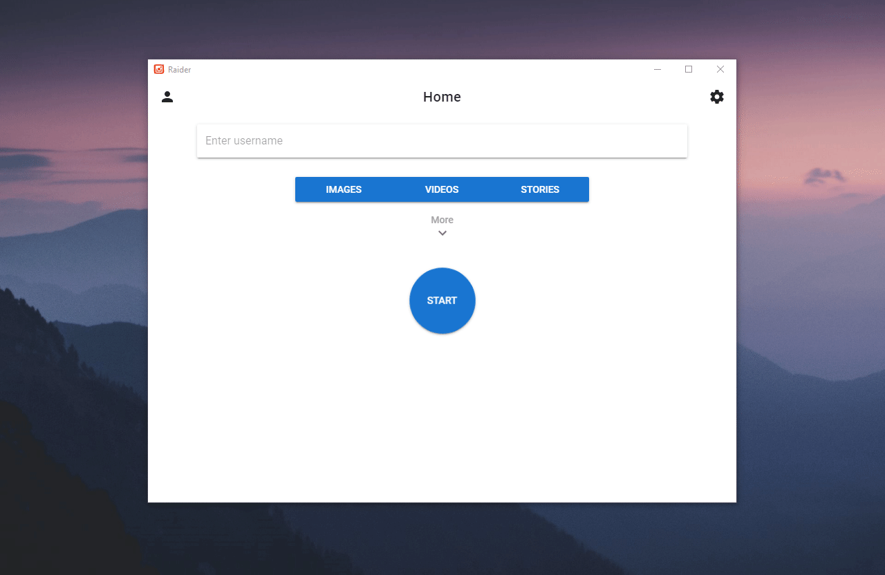
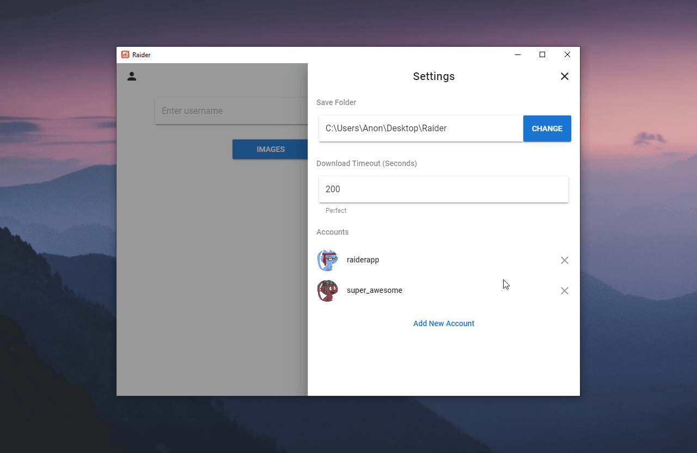

#  Raider for Instagram
> An Instagram downloader desktop application

Raider allows you to easily download Instagram images, videos and stories.

## Installation

* ### [Windows](https://github.com/AssetKid/raider-release/releases/latest)
* ### MacOS - Not Available
* ### Linux - Not Available

Mac & Linux are on the roadmap. Kindly [support the project](#support-the-project) if you would like to see more platforms and features added in the future.

## Features

* ### Clean Minimal Design

Raider is simple, clean and easy to use.

* ### Download from Private Accounts

Login with your Instagram credentials and download photos from private accounts that you follow.

* ### Multiple Accounts Support

Raider allows you to add multiple accounts and switches between them seamlessly when downloading from private accounts.

* ### Subscribe to Accounts

Every time you download an account using Raider, we add it to your subscribed accounts section. You can update a single account or all of them anytime.

* ### Edit/Delete Subscribed Accounts

Want to change the username of a subscribed account? Maybe rename the folder name? Raider allows you to easily do so.

Just long click on any account to enter **Edit Mode**.

## Support the Project

Despite taking weeks to research, design and code, Raider does not contain a single ad, any trackers or in app purchases. It is completely free to use.

If you would like to see more features added in the future and keep the app free, kindly support the author on Patreon.

## Credits

Icon made by [Alex Prunici](https://www.iconfinder.com/AlexAPR)
